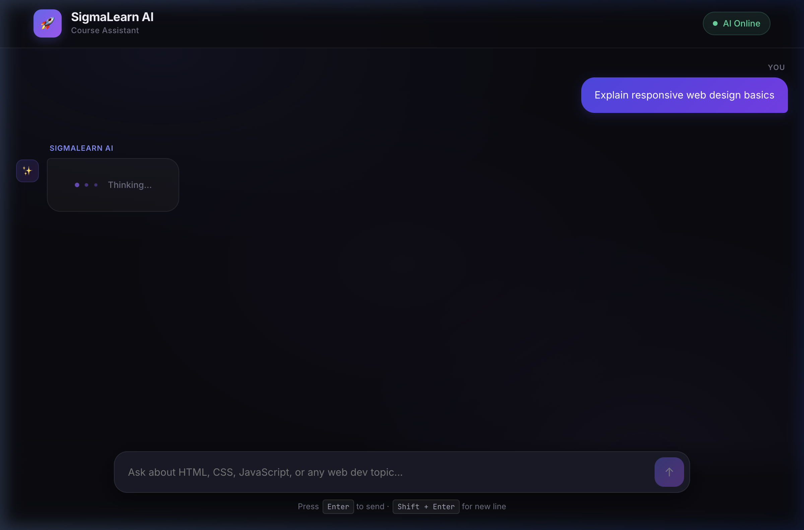

# 🎓 SigmaLearn AI — RAG-Based Teaching Assistant

> An AI-powered teaching assistant for the **Sigma Web Development Course** that answers questions using actual video subtitles and timestamps, built with Retrieval-Augmented Generation (RAG).

[](https://sigmalearn-ai.vercel.app/)


---

## ✨ Features

- 🔍 **RAG-powered answers** — searches through real video subtitle chunks, not generic web content
- ⏱️ **Timestamped responses** — every answer includes exact video references like "Video #14 at 04:17"
- 🤖 **Gemini AI** — uses Google's `gemini-2.0-flash-lite` for generation and `gemini-embedding-001` for semantic search
- 💬 **Chat interface** — clean, modern UI with suggested questions and source cards
- 🔄 **Auto-retry** — handles free-tier rate limits with exponential backoff
- 🚀 **Deployed on Vercel** — serverless, zero-infrastructure

---

## 🛠️ Tech Stack

| Layer | Technology |
|---|---|
| **Frontend** | Next.js 15, React, Vanilla CSS |
| **AI / Embeddings** | Google Gemini API (`gemini-embedding-001`, `gemini-2.0-flash-lite`) |
| **RAG Search** | TF-IDF + cosine similarity on pre-computed embeddings |
| **Data Pipeline** | Python (yt-dlp, Whisper, scikit-learn) |
| **Deployment** | Vercel (serverless) |

---

## 📁 Project Structure

```
RAG_Based_Teaching_Assistant/
├── web/                        # Next.js web app
│   ├── src/
│   │   ├── app/
│   │   │   ├── api/ask/        # API route — RAG + Gemini generation
│   │   │   ├── page.js         # Main chat page
│   │   │   └── globals.css     # Global styles
│   │   ├── components/         # React components
│   │   │   ├── ChatInterface.jsx
│   │   │   ├── InputBar.jsx
│   │   │   ├── MessageBubble.jsx
│   │   │   ├── SourceCards.jsx
│   │   │   └── Header.jsx
│   │   └── lib/
│   │       ├── gemini.js       # Gemini API wrapper (with retry logic)
│   │       └── rag.js          # TF-IDF search over embeddings
│   ├── data/
│   │   └── embeddings.json     # Pre-computed video subtitle embeddings (~24MB)
│   └── vercel.json
│
├── downloading_videos.py       # Download Sigma course YouTube videos
├── mp3_to_json.py              # Transcribe audio → JSON subtitle chunks
├── merge_chunks.py             # Merge and clean subtitle chunks
├── reembed_from_jsons.py       # Generate Gemini embeddings from chunks
├── convert_joblib_to_json.py   # Convert embeddings.joblib → embeddings.json
├── requirements.txt            # Python dependencies
└── Dockerfile                  # Optional Docker deployment
```

---

## 🚀 Getting Started

### Prerequisites
- Node.js 22+
- A [Gemini API key](https://aistudio.google.com) (free tier works)

### 1. Clone the repo

```bash
git clone https://github.com/Sanskar1314/RAG_Based_Teaching_Assistant.git
cd RAG_Based_Teaching_Assistant/web
```

### 2. Install dependencies

```bash
npm install
```

### 3. Set up environment variables

Create a `.env.local` file in the `web/` directory:

```env
GEMINI_API_KEY=your_gemini_api_key_here
```

### 4. Run the dev server

```bash
export PATH="/opt/homebrew/opt/node@22/bin:$PATH"  # macOS only
npm run dev
```

Open [http://localhost:3000](http://localhost:3000) 🎉

---

## ☁️ Deploy to Vercel

1. Push this repo to GitHub
2. Go to [vercel.com](https://vercel.com) → **New Project** → Import your repo
3. Set **Root Directory** to `web`
4. Add environment variable:
   - `GEMINI_API_KEY` = your Gemini API key
5. Click **Deploy** 🚀

---

## 🔄 Data Pipeline (Re-embedding)

If you want to add new course videos or regenerate embeddings:

```bash
# Install Python dependencies
pip install -r requirements.txt

# 1. Download course videos (edit URLs in the script first)
python downloading_videos.py

# 2. Transcribe audio to JSON chunks
python mp3_to_json.py

# 3. Merge and clean chunks
python merge_chunks.py

# 4. Generate Gemini embeddings
python reembed_from_jsons.py

# 5. Convert to JSON for web app
python convert_joblib_to_json.py
```

---

## ⚠️ Free Tier Rate Limits

The app uses `gemini-2.0-flash-lite` which has the most generous free quota:

| Limit | Value |
|---|---|
| Requests per minute | 30 RPM |
| Requests per day | 1,500 RPD |
| Tokens per minute | 1M TPM |

If you hit rate limits, the app **automatically retries** with exponential backoff (5s → 10s → 20s → 40s → 60s max). For production with multiple users, upgrade to a paid Gemini API key.

---

## 📸 Screenshots

[](https://sigmalearn-ai.vercel.app/)

> 🔗 **Live at [sigmalearn-ai.vercel.app](https://sigmalearn-ai.vercel.app/)**

---

## 📄 License

MIT License — feel free to use and modify for your own courses!

---

<p align="center">Built with ❤️ for the Sigma Web Development community</p>
